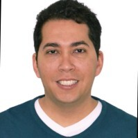

```{r setup, include=FALSE}
knitr::opts_chunk$set(echo = FALSE)


```

{width=200}

Médico de la [Universidad de Cartagena](https://www.unicartagena.edu.co/), estudié y me gradué  como Tl. en la misma Universidad del programa Administración de los Servicios de la Salud.

I am a Physician from the [University of Cartagena](https://www.unicartagena.edu.co/); I studied and graduated as a Tl. at the same University in the Health  Management program. 

Posteriormente por mi interés por los aspectos financieros de sostenibilidad del sistema y cómo optimizar las operaciones en el mismo me llevo a estudiar la  Especialización en Gerencia Financiera en la [Universidad Jorge Tadeo Lozano](https://www.utadeo.edu.co/es). Tomé varios cursos de formación y profundización en Economía de la Salud con el Banco Mundial.

Later, my interest in the financial aspects of the system's sustainability and how to optimize its operations led me to study the Specialization in Financial Management at  [Jorge Tadeo Lozano University](https://www.utadeo.edu.co/es). Finally,  I took several training courses in Health Economics with the World Bank.

Entendiendo que el problema de la salud y el bienestar de las comunidades  es un asunto de decisiones que corresponde al ámbito de lo público y de las políticas que se adoptan decido dedicar varios años a profundizar estos temas, graduándome  con una Maestría en Salud Pública y otra Maestría en Políticas Públicas en la [Universidad de los Andes](https://uniandes.edu.co/). 

Understanding that the problem of health and welfare of communities is a matter of decisions that correspond to the public sphere and the policies that are adopted, I decided to dedicate several years to deepen these issues, graduating with a Masters in Public Health and a Masters in Public Policy at the [University of the Andes](https://uniandes.edu.co/). 

Con el convencimiento de utilizar una perspectiva científica de análisis de la información  he trabajado en proyectos de  manejo de datos, desde la recolección hasta el análisis y uso efectivo de los mismos. [Algo sobre la educación en datos](https://www.credly.com/users/ilich-herbert-de-la-hoz-siegler/badges) 

With the conviction of using a scientific perspective of information analysis for better decisions, I have worked in data management projects, from data collection to analysis and effective data use.  [A  bit about data training](https://www.credly.com/users/ilich-herbert-de-la-hoz-siegler/badges)

